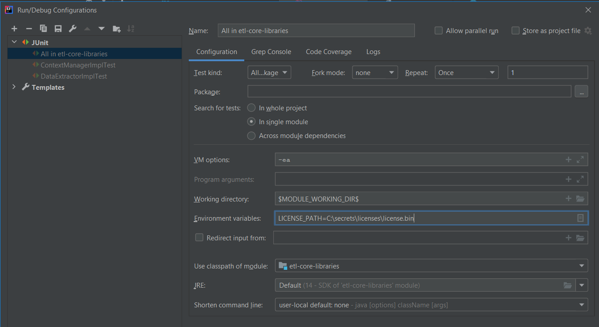
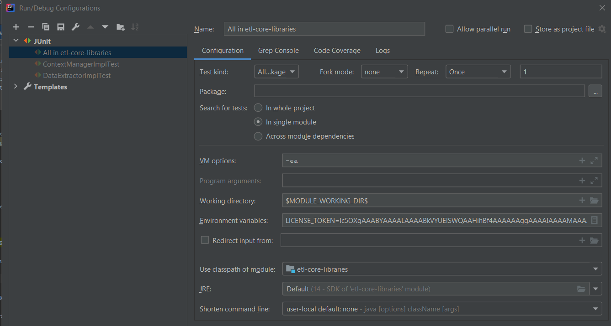

# Next Gen Testing Platform


Next Gen Testing Platform is a behavior driven development (BDD) based test automation framework to test Web, API, Desktop, ETL and many other applications.
It enables you to write and execute automated acceptance/unit tests.
Automate your test cases with minimal coding.
[More Details](http://ey.com/ngtp)

## Table of Contents
<ul>
	<li>
		<a href = "#introduction">Introduction</a>
	</li>
	<li>
		<a href = "#installation">Installation</a>
		<ol>
			<li>
				<a href = "#version-control-system">Version Control System</a>
				<ul>
					<li><a href = "#git">Git</a></li>
				</ul>	
			</li>				
			<li><a href = "#install-java-development-kit">Install Java Development Kit</a></li>
			<li><a href = "#download-and-setup-maven">Download and setup Maven</a></li>
			<li><a href = "#download-and-setup-spark">Download and Setup Spark</a></li>
			<li><a href = "#setup-environment-variables">Setup Environment Variables</a></li>
			<li><a href = "#intellij">IntelliJ</a></li>
			<li><a href = "#configure-dependencies-and-addons-libraries">Configure dependencies and addons Libraries</a></li>
		</ol>
	</li>
	<li>
		<a href = "#usage">Usage</a>
		<ol>
		    <li><a href = "#activation-required">Activation Required</a></li>
			<li><a href = "#new-testing-project">New Testing Project</a></li>
			<li><a href = "#writing-a-test">Writing a test</a></li>
			<li><a href = "#object-repositories">Object Repositories</a></li>
			<li><a href = "#test-data">Test Data</a></li>
			<li><a href = "#environment-properties">Environment Properties</a></li>
			<li><a href = "#reusable-steps">Reusable steps</a></li>
			<li><a href = "#auto-fill-web-forms">Auto-fill Web Forms</a></li>
			<li><a href = "#running-tests">Running tests</a></li>
		</ol>	
	</li>
	<li>
		<a href = "#license">License</a>
	</li>
</ul>
	


## Introduction

Next-Gen Testing Platform is a modular 3-tier Test Automation Framework built using Java. Primarily, it leverages Cucumber and Java to achieve the automation objectives and uses Gherkin Language for writing test scripts that also serves a living documentation of acceptance criteria. This document serves as a manual for setting up the Next-Gen Testing Platform in your local machine.

## Setup
Refer https://ey-advisory-technology-testing.github.io/NGTP_Docs/ for prerequisites, setup

## Usage

### Activation Required
The library is license restricted with a digitally-signed EY license. You will need a license file or, a license token added to your project and configured in your run configurations to activate the tool. Reach out to the administrators for a Named license. You will either be given a license file or an authentication token.

#### License File

If given a license file, save it anywhere and note down the path. Provide the path in your environment variables in the below format

| KEY  | VALUE |
|------|-------|
| LICENSE_PATH  | <YOUR LICENSE FILE PATH>|

**Note:** If you are running locally in IntelliJ, you can go to Edit configurations > Environment Variables (under configuration tab) and save the key value pair as LICENSE_PATH=<token value>



#### Authentication Token

If given an authentication token, save the token in environment variables in the below format

| KEY  | VALUE |
|------|-------|
| LICENSE_TOKEN  | <YOUR TOKEN>|


**Note:** If you are running locally in IntelliJ, you can go to Edit configurations > Environment Variables (under configuration tab) and save the key value pair as LICENSE_TOKEN=<token value>



### Writing a test

The cucumber features goes in the `features` library and should have the ".feature" extension. The first line of that file should always be `Feature: [Feature name]`

You can start out by looking at `amazonDemo/features/product_checkout.feature`. You can automate most applications using some of the [reusable steps](src/main/java/seleniumutils/reusablestepdefinitions) that comes with Next Gen Testing Platform.

### Object Repositories

In Next Gen Testing Platform, page or screen locators are maintained in flat files externally. You can store all your locators in EXCEL, YAML or JSON format. The file name should always be
PageObjects.xlsx/PageObjects.yaml/PageObjects.json
- The locators will be organized in Object-oriented fashion as:

```Page contains elements contains attributes```

Interpreted in xlsx, this will be:

- Page     => sheets  e.g Amazon sheet
- elements => rows 

**Example**

| element_type  | variable      | value         | id            | class         | name          | xpath         | css           | linktext      | partiallinktext | tagname       |
|---------------|---------------|---------------|---------------|---------------|---------------|---------------|---------------|---------------|-----------------|---------------|
| input         | username      |               | Text1         |               |               |               |               |               |                 |               |
| link       | asus_zenbook   	|               | 	        |               |               | (//*[contains(text(),'ASUS ZenBook 13')])[1]              |               |               |                 |               |


In JSON, this will be:

````json
{
   "Amazon": 
   [
      {
         "element_type": "data",
         "variable": "home",
         "value": "http://www.amazon.com",
         "id": "",
         "class": "",
         "name": "",
         "xpath": "",
         "css": "",
         "linktext": "",
         "partiallinktext": "",
         "tagname": ""
      },
      {
         "element_type": "textbox",
         "variable": "search_bar",
         "value": "",
         "id": "twotabsearchtextbox",
         "class": "",
         "name": "",
         "xpath": "",
         "css": "",
         "linktext": "",
         "partiallinktext": "",
         "tagname": ""
      }
   ],
  "SecurityPage": 
   [
        {
           "element_type": "",
           "variable": "edit_name",
           "value": "",
           "id": "auth-cnep-edit-name-button",
           "class": "",
           "name": "",
           "xpath": "",
           "css": "",
           "linktext": "",
           "partiallinktext": "",
           "tagname": ""
        }
   ]
}
````
In YAML,

````
"Amazon":
  - element_type: data
    variable: home
    value: 'http://www.amazon.com'
    id: ""
    class: ""
    name: ""
    xpath: ""
    css: ""
    linktext: ""
    partiallinktext: ""
    tagname: ""

  - element_type: textbox
    variable: search_bar
    value: ""
    id: twotabsearchtextbox
    class: ""
    name: ""
    xpath: ""
    css: ""
    linktext: ""
    partiallinktext: ""
    tagname: ""
    
"SecurityPage":
  - element_type: ""
    variable: edit_name
    value: ""
    id: auth-cnep-edit-name-button
    class: ""
    name: ""
    xpath: ""
    css: ""
    linktext: ""
    partiallinktext: ""
    tagname: ""
    
  - element_type: ""
    variable: success_verification
    value: ""
    id: ""
    class: ""
    name: ""
    xpath: '//*[@id="auth-success-message-box"]/div/h4'
    css: ""
    linktext: ""
    partiallinktext: ""
    tagname: ""    
````

### Test Data

As with Page Objects, Test data is also supported in the above 3 formats
You can refer to any of the sample projects for the data formats. The path is shared above in the New project section.

### Environment Properties

All Test environment properties and run configurations can either be setup through cucumber.properties or added to your POM.xml under the properties tag 
or even fed at runtime through command line options as -D<propertyname>=<value> after your maven command. The exact syntax is highlighted below under Running the test section.
But the mandatory properties are:
- application
- environment
- browser

### Reusable steps

By using reusable steps you can automate your test cases more quickly, more efficiently and without much coding.
The reusable steps are located in the etl-step-definitions jar and etaf-step-definitions jar

### Auto-fill Web Forms

With Next Gen Testing Platform you can fill either a single field or an entire page or even multiple pages with a single step using this step

```
I fill (.+) data from (.+) (?:yaml|sheet|json) onto the page
e.g Given I fill personal data from checkoutpage yaml onto the page
```

Note: Make sure you do have a dataset called PERSONAL in your checkoutpage.yaml (or json or excel sheet) to test this example

### Dynamic/Random Data Generation


Next Gen Testing Platform allows you to generate commonly used data like name, addresses Identification informations automatically. You only have to specify either what information you want or what pattern of data you want to be entered into a particular field and then Next Gen Testing Platform automatically generates that information for you.
This helps every test run of yours to be unique. Refer [checkoutpage.yaml](src/test/resources/amazonDemo/data/inputdata/checkoutpage.yaml) on how to setup dynamic data

### Running tests

**Terminal**

Go to your project directory from terminal and hit following commands

**IDE**
- Open FunctionalCukesTest.java located under src/test/java/methods
- Add the tag you want to run under CucumberOptions Annotation
- Click Run button on the top right of your IDE (or from your right click context menu)

**API Tests**

The `cucumber.properties` file has 3 key properties at the end of the file

- karate=<ENV>
- source.feature=<application path of your API tests>
- karate-tags=<tags you want to test>

Provide the appropriate values for these tags and right click run the APIRunner class. It will automatically pick up the tests with the corresponding tags from the application path you have mentioned and run the tests in parallel


**Parallel Execution**
Next Gen Testing Platform uses native cucumber to parallelize the execution process. 

#### Run Features in Parallel
If you have 4 feature files(a,b,c,and d) with 2 scenarios each(1 and 2), and you want to run all the files in parallel using 4 threads, but the scenarios in each file in a sequence,
use the following command: ```mvn [clean] [verify|install] -Dcucumber.filter.tags="@a or @b" -DtestType=Feature```

e.g

mvn clean install -Dcucumber.filter.tags="@a or @b" -DtestType=Feature
If using a macbook and for some reason the above command is not working, then try
`mvn clean install -D"cucumber.filter.tags=@a or @b" -DtestType=Feature` (enclosing the whole property within quotes instead of just the value)

This will run the scenarios in the following way,

| Thread 1  (Feature a)    | Thread 2 (Feature b)     | Thread 3 (Feature c)     | Thread 4 (Feature d)     |
|--------------------------|--------------------------|--------------------------|--------------------------|
|    Scenario 1            | Scenario 1               |   Scenario 1             |Scenario 1                |
|    Scenario 2            | Scenario 2               |   Scenario 2             |Scenario 2                |

#### Run Scenarios in Parallel
If you have 4 feature files(a,b,c,and d) with 2 scenarios each(1 and 2), and you want to run all the scenarios in parallel using 4 threads and do not care about the ordering,
use the following command: ```mvn [clean] [verify|install] -Dcucumber.filter.tags="@a or @b" -DtestType=Scenario```

e.g

mvn clean install -Dcucumber.filter.tags="@a or @b" -DtestType=Scenario
If using a macbook and for some reason the above command is not working, then try
`mvn clean install -D"cucumber.filter.tags=@a or @b" -DtestType=Scenario` (enclosing the whole property within quotes instead of just the value)

It will run scenarios in order of their feature file names first and then by their order of occurence within the feature file

So in above example

| Thread 1      | Thread 2   | Thread 3     | Thread 4     |
|--------------------------|--------------------------|--------------------------|--------------------------|
|    Feature a Scenario 1            |  Feature a Scenario 2               |   Feature b Scenario 1             | Feature b Scenario 2                |
|    Feature c Scenario 1            |  Feature c Scenario 2               |   Feature d Scenario 1             | Feature d Scenario 2                |

#### Run API Scenarios in Parallel
To run API tests from terminal, simply run the following command

```mvn test -Dtest=[Runner Class] -Dskip_surefire=false -Dskip_failsafe=true -Dapplication=[application name of your ngtp api tests folder ]  -Dkarate-tags=[tags] -Dsource.feature=[application path of your api tests] -DforkCount=[thread/fork count]```

e.g.

```mvn test -Dtest=APIRunner -Dskip_surefire=false -Dskip_failsafe=true -Dapplication=APITests -Dkarate-tags=@apitest -Dsource.feature=src/test/resources/APITests -DforkCount=1```

This will run all the tests with tag `@apitest` for the application `APITests` under the folder `src/test/resources/APITests` using the runner class `APIRunner` using `1` as thread count 
## License

© 2020 Ernst & Young LLP. All Rights Reserved. Any unauthorized use or disclosure is strictly prohibited.
